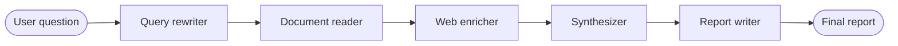

# Document Intelligence Agent

A five-stage research workflow built with LangGraph. It refines a question, searches a local LLM production guide, enriches the result with live web search, synthesizes the evidence, and produces a concise report. LangSmith can trace the complete pipeline without adding manual tracing code to each node.

## How it works



| Stage | Implementation | Output |
| --- | --- | --- |
| Query rewriter | Groq (`llama-3.3-70b-versatile`) | A clearer, search-friendly question |
| Document reader | Keyword search | Relevant passages from the local knowledge base |
| Web enricher | Google Serper | Current web-search results |
| Synthesizer | Groq | A combined analysis of local and web evidence |
| Report writer | Groq | A report with a TL;DR, key findings, and conclusion |

The workflow is intentionally sequential: every request passes through all five stages. If web search fails, the failure is included in the state and the remaining stages continue.

## Project structure

```text
.
├── agent/
│   ├── graph.py       # LangGraph workflow and compiled graph
│   ├── nodes.py       # Pipeline node implementations
│   ├── state.py       # Shared AgentState definition
│   └── tools.py       # Local document loading and keyword search
├── data/
│   └── llm_production_guide.txt
├── app.py             # Streamlit chat interface
├── graph_entry.py     # LangGraph CLI/Studio entry point
├── langgraph.json     # LangGraph project configuration
└── requirements_with_version.txt
```

## Prerequisites

- Python 3.11 (the pinned dependencies were tested with Python 3.11.3)
- A [Groq](https://console.groq.com/) API key
- A [Serper](https://serper.dev/) API key
- Optional: a [LangSmith](https://smith.langchain.com/) API key for tracing

## Setup

Create and activate a virtual environment, then install the pinned dependencies:

```bash
python -m venv .venv

# macOS/Linux
source .venv/bin/activate

# Windows PowerShell
.venv\Scripts\Activate.ps1

pip install -r requirements_with_version.txt
```

Create a `.env` file in the project root:

```env
GROQ_API_KEY=gsk_...
SERPER_API_KEY=...

# Optional LangSmith tracing
LANGSMITH_TRACING=true
LANGSMITH_API_KEY=lsv2_...
LANGSMITH_PROJECT=document-intelligence-agent
```

Do not commit `.env` or expose its secrets.

## Run the app

Start the Streamlit interface:

```bash
streamlit run app.py
```

Then ask a question such as:

- What are the biggest LLM security risks in production?
- How does RAG reduce hallucinations?
- What is LLM-as-Judge evaluation?
- What are the best practices for deploying LLM agents?

The response includes an expandable pipeline summary with the refined question, nodes executed, number of local sections found, and session ID.

## Run with LangGraph Studio

The repository exposes `graph_entry.py:graph` through `langgraph.json`. Start the local LangGraph development server with:

```bash
langgraph dev
```

The graph is registered as `document_intelligence_agent`.

## LangSmith tracing

When the three `LANGSMITH_*` variables above are configured, LangChain and LangGraph automatically record the graph run, node executions, model calls, inputs, outputs, latency, and token usage. Open the configured project in LangSmith to inspect a trace.

No explicit spans or decorators are required in `agent/nodes.py` for this workflow.

